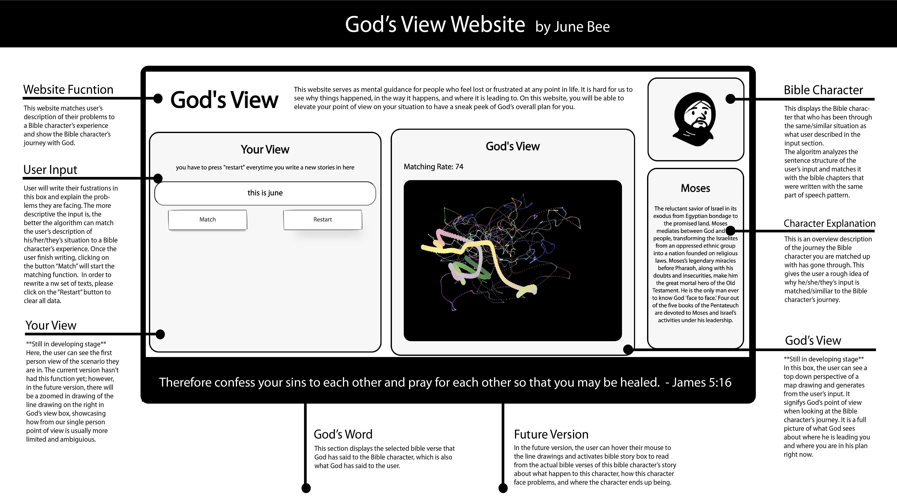

# God's View
<!-- 1-2 sentence description of assignment. Nice to include a screenshot or .gif of the site in action. -->

This website serves as mental guidance for people who feel lost or frustrated at any point in life. It is hard for us to see why things happened, in the way it happens, and where it is leading to. On this website, you will be able to elevate your point of view on your situation to have a sneak peek of God’s overall plan for you.
## About

### Process & Documentation
Share your design and technical process.
### Challenges & Struggles
What challenges and struggles did you face?
### References
Credit resources appropriately 
