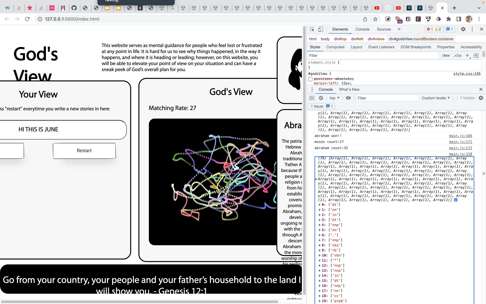

# God's View
<!-- 1-2 sentence description of assignment. Nice to include a screenshot or .gif of the site in action. -->

This website serves as mental guidance for people who feel lost or frustrated at any point in life. It is hard for us to see why things happened, in the way it happens, and where it is leading to. On this website, you will be able to elevate your point of view on your situation to have a sneak peek of God’s overall plan for you.

**Click here for...**

>[💻 Website](https://junebee66.github.io/gods_view/index.html) [⏯ Video Demo](https://youtu.be/JLcgsHWjtmQ)

## **💡About**

#### **⭐️ Website Functionality**
>This website matches user’s description of their problems to a Bible character’s experience and show the Bible character’s journey with God.

#### **⭐️ User Input**
>User will write their fustrations in this box and explain the problems they are facing. The more descriptive the input is, the better the algorithm can match the user’s description of his/her/they’s situation to a Bible character’s experience. Once the user finish writing, clicking on the button “Match” will start the matching function.  In order to rewrite a nw set of texts, please click on the “Restart” button to clear all data.

#### **⭐️ Your View**
_- Still in developing stage -_

>Here, the user can see the first person view of the scenario they are in. The current version hasn’t had this function yet; however, in the future version, there will be a zoomed in drawing of the line drawing on the right in God’s view box, showcasing how from our single person point of view is usually more limited and ambiguious.

#### **⭐️ God’s View**
_-Still in developing stage-_

>In this box, the user can see a top down perspective of a map drawing and generates from the user’s input. It signifys God’s point of view when looking at the Bible character’s journey. It is a full picture of what God sees about where he is leading you and where you are in his plan right now. 

#### **⭐️ Bible Character**
>This displays the Bible character that who has been through the same/similar situation as what user described in the input section. The algoritm analyzes the sentence structure of the user’s input and matches it with the bible chapters that were written with the same part of speech pattern. The algoritm analyzes the sentence structure of the user’s input and matches it with the bible chapters that were written with the same part of speech pattern. In the future version, the user can hover their mouse to the line drawings and activates bible story box to read from the actual bible verses of this bible character’s story about what happen to this character, how this character face problems, and where the character ends up being.

#### **⭐️ Character Descriptions**
>This is an overview description of the journey the Bible character you are matched up with has gone through. This gives the user a rough idea of why he/she/they’s input is matched/similiar to the Bible character’s journey.

#### **⭐️ God’s Word**
>On the bottom section, it displays the selected bible verse that God has said to the Bible character, which is also what God has said to the user.

## **✍🏻Process & Documentation**

For this project, I wrote an algorithm to analyze the sentence structure of user's input and match it with the part of speech sentence pattern with Bible characters descriptions. It was a hard  

## **🛑Challenges & Struggles**
<!-- What challenges and struggles did you face? -->
The two biggest problem I faced is to: 

- come up with a reasonable way to match the user's input with bible stories
- generate meaningful visuals based on input value

I spent almost 8 hrs with the DT study tutor, Elena Peng, on this Tuesday (4/19) to come up with a text algorith. We searched and tried other libaries online for tone indicators in order to analyze the user's input into more abstracted ideas such as emotions and positive negatives contents. We first found the [Tone Analyzor](https://tone-analyzer-demo.ng.bluemix.net/) by IBM; however, the process of setting up the API was too complicated for the limited time I have, so we gave up on that one. Later, we discovered [Text Razor](https://www.textrazor.com/docs/rest) that identifies all the emotions and generate synonyms for the targeted text. When we look into their documentation, we realized that their targeted user/language is Python and there wasn't a reference for Javascript. Therefore, we looked into how to import REST API into my javscript code. After numerous tries, due to possibly code format or syntax problems, we counldn't intergrated into my project. Therefore, we decided to go back into using [Rita.js](https://rednoise.org/rita/) to just make a prototype for the Thursday (4/21) deadline.

Due to the time limitation, I wasn't able to fully configure the code for both God's and User's view boxes, which are also the major part of this project. Both boxes should have drawings generated by user's input and the calculation of Bible API. I was struggling having p5 cnavas running in regular javascript code. In the end, I still figured out, but used up a large part of my time. In the future, I planned to complete this part.

## **References**
<!-- Credit resources appropriately -->
Text Analyz: [Rita.js](https://rednoise.org/rita/)

